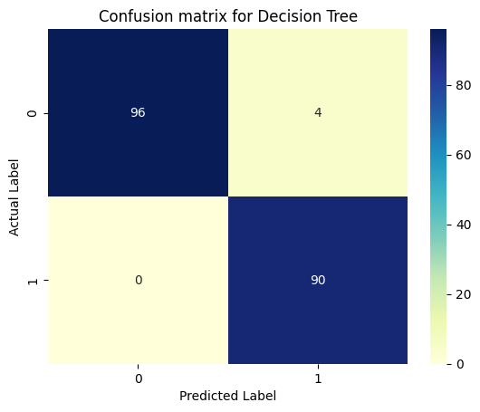
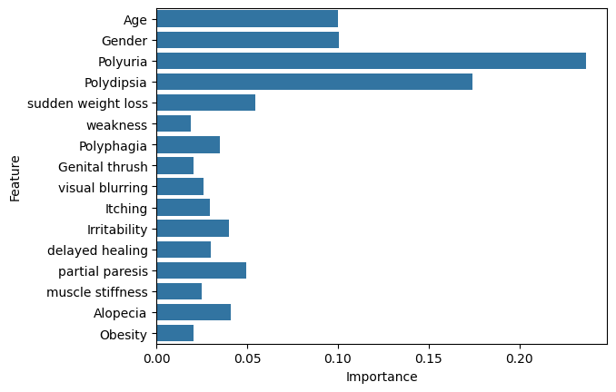
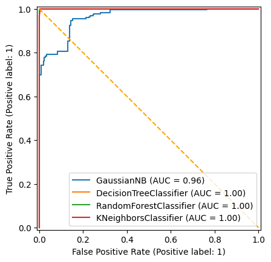

# diabetes_classification
“Machine learning model for predicting diabetes using UCI dataset.”
# 🩺 Diabetes Classification with Machine Learning

This project predicts whether a patient is likely to have diabetes based on symptom data using multiple machine learning classification models.

## 📊 Overview

Using the UCI Diabetes Symptoms dataset, we built and evaluated models like Random Forest, Naive Bayes, Decision Tree, and KNN. The goal was to maximize accuracy while handling imbalanced data using SMOTE.

## 🧠 Key Features

- Cleaned and preprocessed raw categorical data
- Applied SMOTE to balance class distribution
- Trained and compared 4 classification models
- Visualized model performance using ROC curve, confusion matrix, and feature importance
- Achieved **98% accuracy** with Random Forest

## 🔍 Models Used

- ✅ Random Forest (Best Performance)
- Naive Bayes
- Decision Tree
- K-Nearest Neighbors (KNN)

## 📈 Results

| Model          | Accuracy | Precision | Recall | F1 Score |
|----------------|----------|-----------|--------|----------|
| Random Forest  | 0.98     | 0.98      | 0.98   | 0.98     |
| Naive Bayes    | 0.93     | 0.94      | 0.92   | 0.93     |
| Decision Tree  | 0.96     | 0.96      | 0.96   | 0.96     |
| KNN            | 0.91     | 0.91      | 0.91   | 0.91     |

### 🔍 Confusion Matrix

### 📊 Feature Importance

### 📈 ROC Curve

## 📁 Files Included

- `diabetes_model.ipynb` – Main notebook with code and analysis
- `images/` – Visualizations used in the project (confusion matrix, feature importance, etc.)
- `data/` – Not included (see Data Source below)

## 📂 Data Source

[UCI Diabetes Dataset](https://archive.ics.uci.edu/ml/datasets/Early+stage+diabetes+risk+prediction+dataset.)
